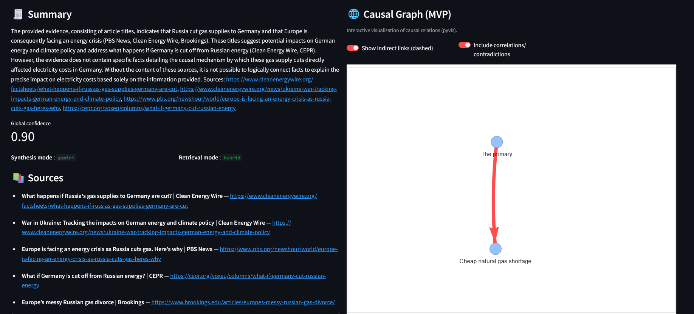

# 🧠 Common Sense Engine (CSE)

[](https://www.python.org/) [](https://fastapi.tiangolo.com/) [](https://streamlit.io/) [](https://www.elastic.co/) [](https://cloud.google.com/vertex-ai) [](https://www.docker.com/) [](#credits--license)

> **Multi-agent explanatory AI**: turns hybrid retrieval (Elasticsearch) into **sourced causal chains** with a graph view and **LLM-backed summarization** (Vertex AI / Gemini). Ships with a FastAPI backend and Streamlit UI.

---

## Table of contents

- [Quick overview](#quick-overview)
- [Example result](#example-result)
- [Features](#features)
- [Stack & architecture](#stack--architecture)
- [Install & run (TL;DR)](#install--run-tldr)
- [Configuration (env vars)](#configuration-env-vars)
- [Index your data (JSONL → Elasticsearch)](#index-your-data-jsonl--elasticsearch)
- [Run the API](#run-the-api)
- [Run the Streamlit UI](#run-the-streamlit-ui)
- [API reference](#api-reference)
- [Data & Elasticsearch schema](#data--elasticsearch-schema)
- [Deployment (Docker / Cloud Run)](#deployment-docker--cloud-run)
- [Security & compliance](#security--compliance)
- [Troubleshooting (FAQ)](#troubleshooting-faq)
- [Roadmap](#roadmap)
- [Credits & license](#credits--license)

---

## Quick overview

- **Goal**: answer *“Why … ?”* questions by retrieving **facts** (Elasticsearch), connecting them with **explicit causal links**, ordering events in **time**, and producing a clear **summary** with clickable **sources**.
- **Pipeline**: `FactFinder → CausalityMapper → NodeSummarizer (Gemini) → ImplicitInferencer → TemporalOrganizer → Synthesizer (Gemini)` + optional conversational hints.
- **Transparency**: returns the **graph** (nodes/edges), **evidence snippets** (with spans), **scores**, and **links to sources**.

**Local demo (example)**

1) Start Elasticsearch (local or Elastic Cloud)  
2) Index `data/samples/secheresse.jsonl`  
3) Start the FastAPI server (port **8080**)  
4) Start the Streamlit UI (port **8501**)  
5) Ask: *“Why did rice prices increase?”*

---

## Example result

<p align="center">
  
  <br>
  <em>Streamlit interface — causal graph (right) and LLM summary (left).</em>
</p>

---

## Features

- 🔎 **Hybrid retrieval** (lexical + vector) with **RRF** (Reciprocal Rank Fusion)
- 🧩 **Event extraction** & **causality detection** via deterministic heuristics (MVP), robust node **de-duplication**
- 🧾 **Node summarization** with **Gemini** (short, human-readable labels, FR/EN)
- 🧠 **Implicit inference** of indirect links (semantic + co-evidence + priors) and **transitivity** *(A→B & B→C ⇒ A→C)*; edges are **dashed**
- 🗓️ **Temporal organization** (date normalization, chronology, annotated edges)
- 🧾 **Global summary**:
  - **Gemini mode** (if API key available) with structured output (answer, confidence, sources)  
  - **Template mode** (offline) otherwise
- 💬 **Conversational core** (short memory, contextual rephrasing, follow-up suggestions)
- 📊 **Streamlit UI**: chat & summary on the left, **PyVis graph** on the right, metadata (mode, confidence), JSON export
- 🧪 **Observability**: structured logs, timing metrics (`@timed`), request IDs

**Current MVP limits**

- Unanchored *correlation/contradiction* statements are **ignored** (no “ghost” edges)
- Causality is **heuristic**; a stricter LLM grounding step can be added later

---

## Stack & architecture

**Stack**: Python 3.11 · FastAPI · Streamlit · Elasticsearch 8.x · Vertex AI (Gemini + Text Embeddings) · PyVis

**Architecture (high level)**

```
User
  ↓
UI (Streamlit)
  ↓
API (FastAPI)
  ↓
Multi-agent orchestrator
  ↓
FactFinder ──▶ CausalityMapper ──▶ NodeSummarizer (Gemini) ──▶
ImplicitInferencer (dashed) ──▶ TemporalOrganizer ──▶ Synthesizer (Gemini)
  └───────────── Elasticsearch (lexical + vector) ─────────────┘
                                   └── Vertex AI (Embeddings/Gemini)
```

**Folders**

```
.
├── agents/                # agents logic (retrieval, causality, time, synthesis, conversation)
├── core/                  # CuriosityCore + Orchestrator
├── api/                   # FastAPI endpoints (/explain, /health)
├── ui/                    # Streamlit app
├── data/                  # Elasticsearch indexer + sample JSONL
├── utils/                 # config, logger, metrics, elastic client
├── modules/               # embedding adapters (local ST)
├── requirements.txt, README.md, .streamlit/secrets.toml
└── .env                   # local only (NOT committed)
```

---

## Install & run (TL;DR)

> **Prereqs**: Python **3.11**, Elasticsearch 8.x (local **or** Elastic Cloud), `pip`.

```bash
# 1) Clone & install
# ⚠️ Requires Python 3.12 (3.11 may cause dependency conflicts)
python3.12 -m venv .venv             # Windows: py -3.12 -m venv .venv
source .venv/bin/activate            # Windows: .\.venv\Scripts\activate
pip install -r requirements.txt      # ⏳ Installation may take several minutes, there are a lot of heavy dependencies

# 2) Start Elasticsearch if you want to work locally
# ⚠️ Quick dev only (no TLS/auth). For prod use Elastic Cloud.
docker run --rm -p 9200:9200 \
  -e "discovery.type=single-node" \
  -e "xpack.security.enabled=false" \
  docker.elastic.co/elasticsearch/elasticsearch:8.15.0

# 3) Create .env (see "Configuration")
cat > .env << 'EOF'
ES_ENDPOINT=http://localhost:9200
ES_INDEX=facts_index
API_HOST=0.0.0.0
API_PORT=8080
# Optional (Gemini for summaries/labels)
# GEMINI_API_KEY=YOUR_GEMINI_API_KEY

# Optional (Vertex embeddings for KNN)
# GOOGLE_APPLICATION_CREDENTIALS=/absolute/path/to/service_account.json
# VERTEX_PROJECT=your-gcp-project
# VERTEX_LOCATION=your-vertex-location

# Optional (Google CSE live ingest)
# GOOGLE_API_KEY=YOUR_GOOGLE_CSE_API_KEY
# GOOGLE_CX=YOUR_CSE_CX
EOF

# 4) Index a sample corpus
python -m data.index_data data/samples/secheresse.jsonl

# 5) Run the API
uvicorn api.main:app --reload

# 6) Run the UI on another terminal
source .venv/bin/activate            # Windows: .\.venv\Scripts\activate
streamlit run ui/app.py
```

---

## Configuration (env vars)

> Loaded via **pydantic-settings** from `.env` and used in `utils/config.py`.

**Core**

| Variable | Purpose | Example |
|---|---|---|
| `ES_ENDPOINT` | Elasticsearch URL (scheme required) | `http://localhost:9200` |
| `ES_INDEX` | Default index name | `facts_index` |
| `ES_USER` / `ES_PASSWORD` | Basic auth (if enabled) | `elastic` / `***` |
| `ES_API_KEY` | API key auth (Elastic Cloud) | `***` |
| `API_HOST` / `API_PORT` | FastAPI bind | `0.0.0.0` / `8080` |
| `LOG_LEVEL` | `DEBUG` / `INFO` / … | `INFO` |

**Gemini (summaries + node labels)**

| Variable | Purpose |
|---|---|
| `GEMINI_API_KEY` or `GOOGLE_API_KEY` | Google Generative AI key used by the **NodeSummarizer** and **Synthesizer** |

**Vertex AI (vector search embeddings)**

| Variable | Purpose |
|---|---|
| `GOOGLE_APPLICATION_CREDENTIALS` | Absolute path to a **Service Account JSON** with Vertex permissions |
| `VERTEX_PROJECT` / `VERTEX_LOCATION` | Enables **Vertex Text Embeddings** (`textembedding-gecko@003`, 768D) |

**Google Custom Search (live ingest)**

| Variable | Purpose |
|---|---|
| `GOOGLE_API_KEY` | Google CSE API key |
| `GOOGLE_CX` | Custom Search Engine CX id |

**Implicit inference (optional tuning)**

| Variable | Purpose | Default |
|---|---|---|
| `INFER_IMPLICIT` | Enable implicit links | `true` |
| `INFER_MIN_SCORE` | Threshold to keep an inferred link | `0.62` |
| `INFER_MAX_EDGES` | Max implicit edges to add | `8` |
| `INFER_TRANSITIVE` | Enable transitivity A→B→C ⇒ A→C | `true` |
| `INFER_CHAIN_MIN` | Min confidence for transitive links | `0.48` |
| `INFER_MAX_CHAIN_EDGES` | Max transitive edges | `8` |
| `INFER_MODEL` | Sentence-Transformers model (fallback) | `sentence-transformers/all-MiniLM-L6-v2` |

**UI (Streamlit)**

`ui/.streamlit/secrets.toml`
```toml
API_URL = "http://localhost:8080"
```

> ℹ️ Without `VERTEX_*`, documents will **not** receive embeddings → **lexical-only** search. With `VERTEX_*`, documents receive a 768D vector (cosine KNN).

---

## Index your data (JSONL → Elasticsearch)

**Expected JSONL record (one doc per line)**
```json
{"title":"...","content":"...","date":"2024-07-12","source_url":"https://...","tags":["economy"]}
```

Supported fields:
- `title` *(str)*, `content` *(str)*, `date` *(YYYY[-MM[-DD]])*, `source_url` *(URL)*, `tags` *(list[str])*
- `id` *(optional)* → deterministically computed otherwise
- `embedding` → **added automatically** if Vertex is configured
- `meta` fields are added internally (see below)

**Create index & ingest**

```bash
python -m data.index_data path/to/my_corpus.jsonl
```

The indexer:
- creates the mapping if missing (incl. `dense_vector` with **auto** dims),
- truncates very large contents,
- normalizes `date` and `tags`.

---

## Run the API

```bash
uvicorn api.main:app --host 0.0.0.0 --port 8080 --reload
```

**Smoke tests**
```bash
# Health
curl -s http://localhost:8080/health

# Explain (basic)
curl -s -X POST http://localhost:8080/explain \
  -H 'Content-Type: application/json' \
  -d '{"query":"Why did rice prices increase?","k":20}' | jq .
```

---

## Run the Streamlit UI

```bash
# Ensure ui/.streamlit/secrets.toml contains API_URL
streamlit run ui/app.py
```

- Left column: summary, confidence, sources, suggestions, JSON export
- Right column: **PyVis graph** (direct and dashed indirect edges; color by weight)

---

## API reference

### `GET /health`

**200**
```json
{ "status": "ok" }
```

### `POST /explain`

**Body**
```json
{
  "query": "Why did rice prices increase?",
  "time_range": {"from": "2020-01-01", "to": "2025-12-31"},
  "k": 20,
  "live": true,
  "live_budget": {"max_docs": 5, "timeout": 8, "max_ms": 4000}
}
```

- `live` (bool): enables **Google CSE discovery + on-the-fly parsing & indexing**  
- `live_budget`: keeps discovery fast and cheap  
- The live-ingested docs are **isolated** to the question using an internal `meta.query_hash`, so they **won’t leak** into other queries.

**Response (excerpt)**
```json
{
  "nodes": [{"id":"n0_ab12","label":"...","time":"2024-07-12","sources":["doc_..."]}],
  "edges": [{"from":"n0_ab12","to":"n1_cd34","relation_type":"causes","confidence":0.6,"style":"solid|dashed"}],
  "facts": [{"id":"...","title":"...","source_url":"https://...","score":0.42}],
  "evidence": [{"doc_id":"...","text":"...","span":[123,160]}],
  "summary": "…",
  "confidence_global": 0.73,
  "retrieval_mode": "hybrid",
  "mode": "gemini|template",
  "live_ingested": ["doc_id1","doc_id2"]
}
```

---

## Data & Elasticsearch schema

- Default index: **`facts_index`**
- Mapping is created automatically with:

```jsonc
{
  "mappings": {
    "dynamic": true,
    "properties": {
      "title":      { "type": "text" },
      "content":    { "type": "text" },
      "date":       { "type": "date", "format": "strict_date||date_optional_time" },
      "source_url": { "type": "keyword" },
      "tags":       { "type": "keyword" },
      "meta": {
        "properties": {
          "query_hash": { "type": "keyword" },
          "request_id": { "type": "keyword" },
          "ingested_at": { "type": "date", "format": "strict_date_optional_time||epoch_millis" }
        }
      },
      "embedding": {                // present if Vertex is enabled
        "type": "dense_vector",
        "dims": <auto>,             // 768 for Vertex textembedding-gecko@003
        "index": true,
        "similarity": "cosine"
      }
    }
  }
}
```

**Retrieval**

- Lexical: `multi_match` on `title^2 + content` (+ optional `range` on `date`)
- Vector: top-level `knn` (ES 8.x) if embeddings exist
- Fusion: **RRF** → global score and `retrieval_mode: hybrid|lexical_only`

**Query isolation**

- Live-ingested docs are stamped with `meta.query_hash` and **filtered** during retrieval to avoid cross-pollution.

---

## Deployment (Docker / Cloud Run)

### Docker (API)

```bash
docker build -t cse-api:latest .
docker run --rm -p 8080:8080 --env-file .env cse-api:latest
```

> UI can run locally, or you can create a separate Dockerfile if you want it containerized.

### Cloud Run (recommended)

- Push the API image to Artifact Registry
- **Secrets**: configure `GEMINI_API_KEY`, `ES_*`, `VERTEX_*`, `GOOGLE_*` via Secret Manager / env vars
- **CORS**: restrict `allow_origins` in production (see `api/main.py`)
- **Elasticsearch**: prefer **Elastic Cloud** for TLS, auth, observability

---

## Security & compliance

- **Never commit** `.env`, API keys, or the Service Account JSON — **rotate immediately** if a key is ever exposed
- Enable TLS/Auth on Elasticsearch in production (Elastic Cloud recommended)
- **Prompt shielding**: the API validates input and keeps logs concise
- **PII**: avoid logging user content; keep short retention

---

## Troubleshooting (FAQ)

**Why is `retrieval_mode = lexical_only`?**  
→ Either embeddings are missing (no `VERTEX_*` during **indexing**) or the index mapping has no `dense_vector`. Re-index after enabling Vertex.

**0 results / no nodes**  
→ If `live=true` and Google CSE is configured, the system will try **live ingest**. Otherwise, check your index contents or increase `k`.

**CORS from UI**  
→ Set a correct `API_URL` in `ui/.streamlit/secrets.toml`. Restrict CORS in prod.

**Gemini quota usage at startup**  
→ Set `DEBUG=false` (default). Warm-ups only happen in debug mode.

---

## Roadmap

- Properly anchor **correlation/contradiction** edges to concrete nodes
- Add **LLM grounding** on cited spans + factual verification
- **What-if** scenario mode
- Public API for third-party consumption
- **Multilingual** (FR/EN/ES)

---

## Credits & license

- Built by the **Common Sense Engine Team** (Elastic × Google Cloud hackathon).  
- License: **MIT**.  
- Thanks to Elasticsearch and Google Cloud / Vertex AI.
